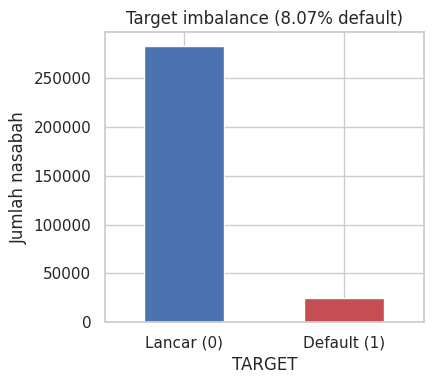
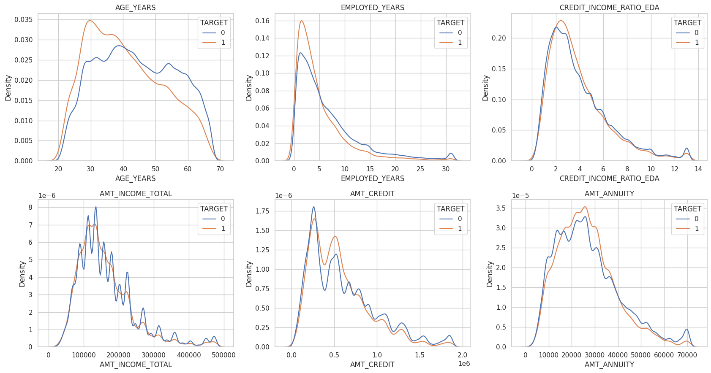
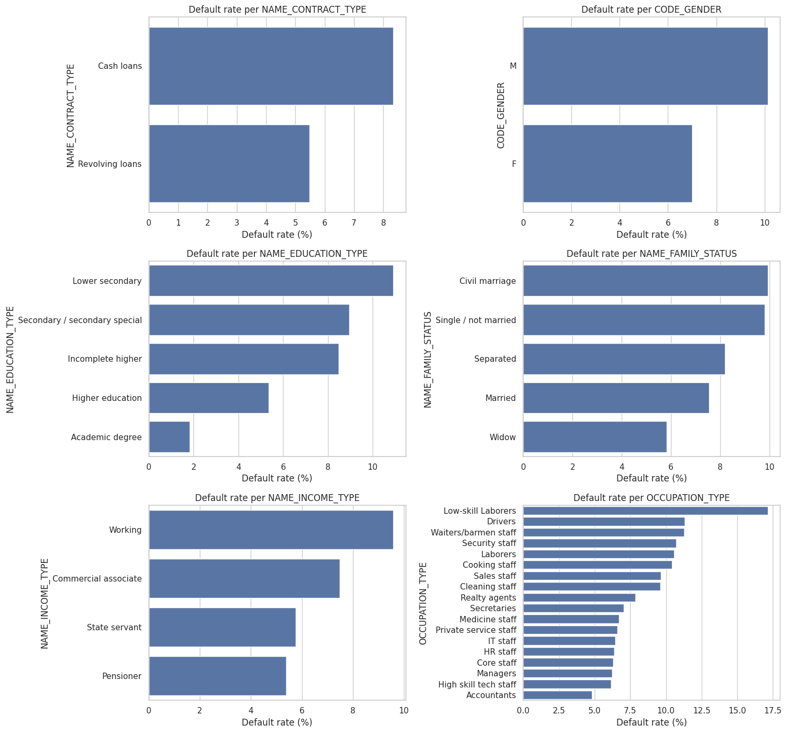
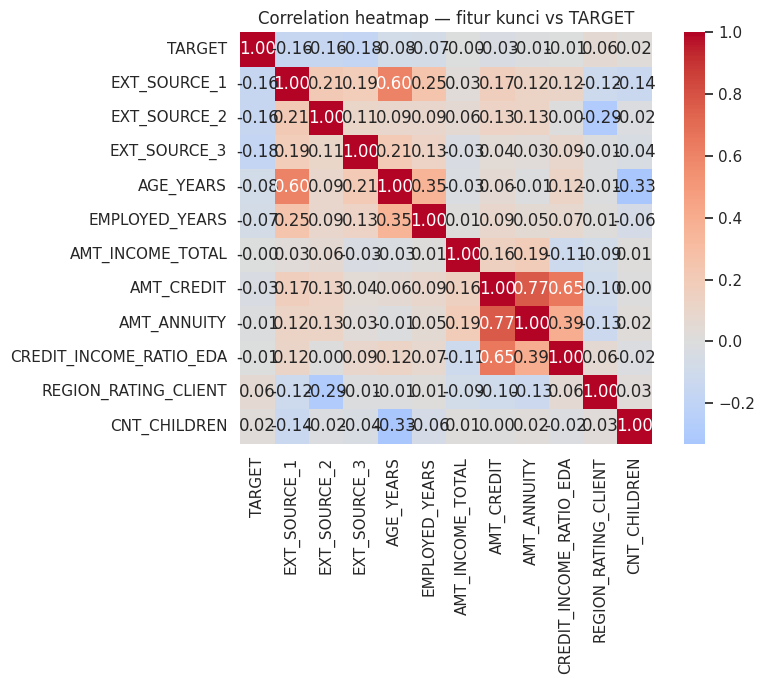
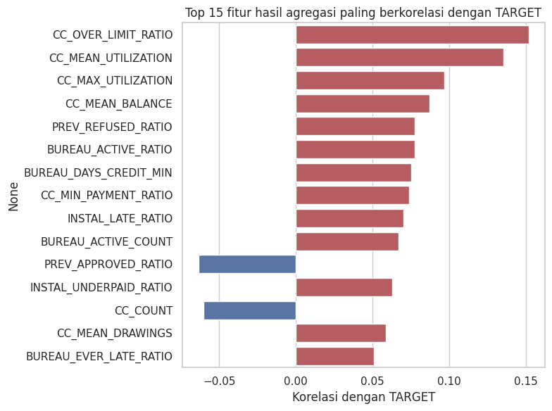
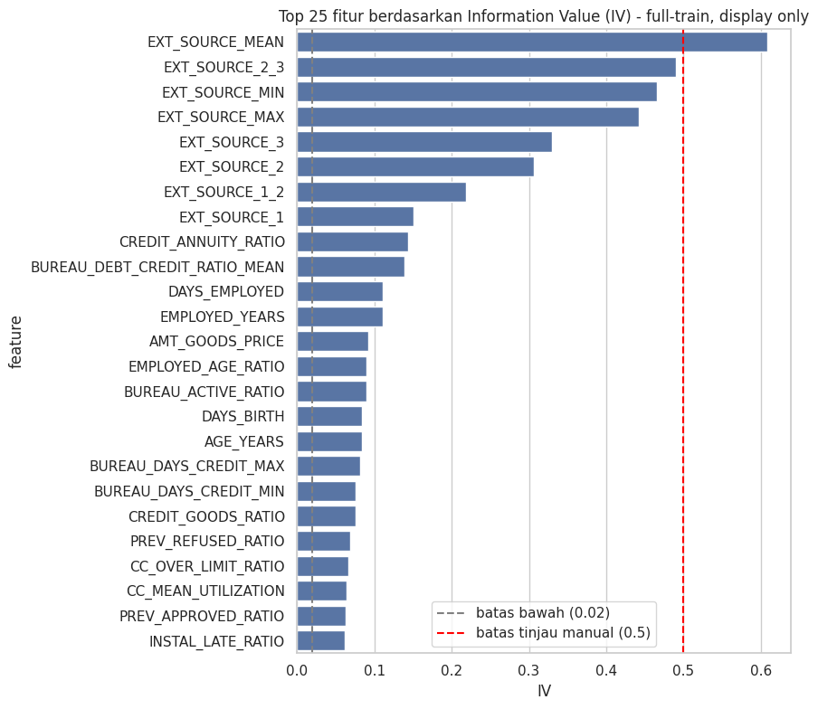
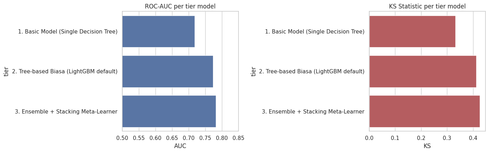
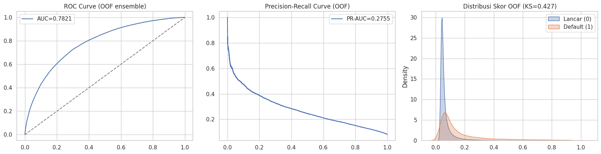
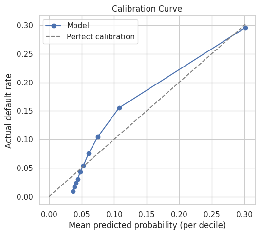
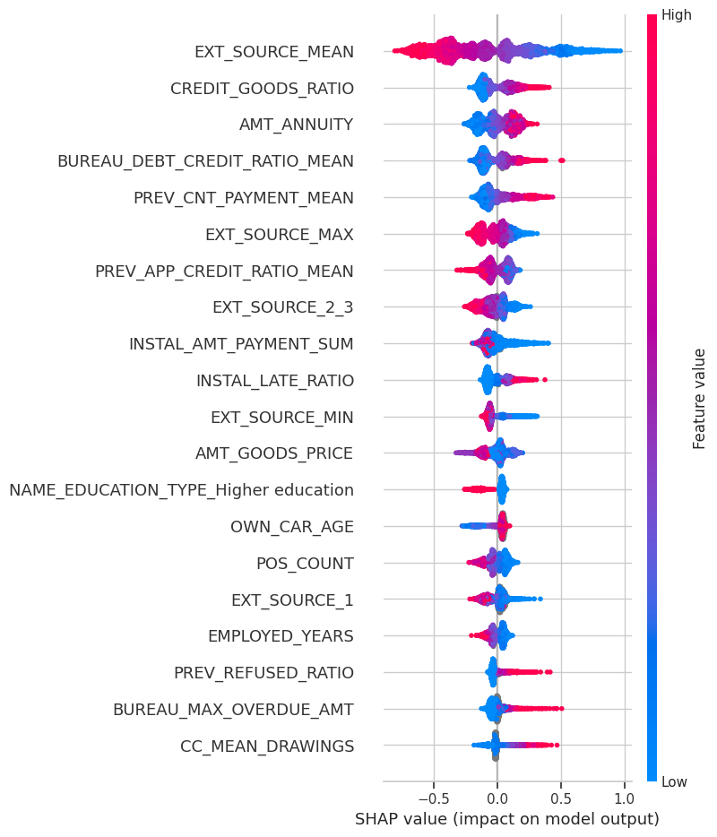

# Credit Scoring & Probability of Default (PD)

**Dataset:** [Home Credit Default Risk — Kaggle](https://www.kaggle.com/competitions/home-credit-default-risk) (Home Credit Group, tabular, metric resmi: ROC-AUC)

---

## 1. Problem Statement

Home Credit melayani segmen **unbanked dan underserved** — calon nasabah yang sebagian besar tidak memiliki riwayat kredit formal di bank. Tanpa credit score konvensional, lembaga sulit menilai siapa yang layak diberi pinjaman, sehingga berisiko menolak nasabah yang sebenarnya baik atau menyetujui nasabah yang akan gagal bayar.

Tujuan proyek ini adalah membangun model yang memperkirakan **Probability of Default (PD)** — seberapa besar kemungkinan seorang nasabah gagal melunasi pinjamannya — dengan memanfaatkan **alternative data**: riwayat transaksi eksternal (credit bureau) dan internal (pengajuan sebelumnya, cicilan, kartu kredit).

Dua tantangan utama:

- **Tidak ada riwayat kredit formal** → sinyal risiko harus digali dari data alternatif yang tersebar di banyak tabel.
- **Class imbalance ekstrem** → hanya **8,07%** nasabah yang default. Model naif yang menebak "semua lancar" sudah 91,93% akurat tetapi gagal total mendeteksi risiko, sehingga akurasi bukan metric yang relevan di sini.

---

## 2. Project Structure

```
├── home-credit-scoring-and-default-probability.ipynb   # notebook pengembangan
├── notebook-final.ipynb                                # notebook hasil run final (dengan output)
├── images/                                             # visualisasi hasil (EDA, modeling, evaluasi)
├── Entity-Relational-Diagram.png                       # skema relasi antar-tabel
├── ext-source.png                                      # ilustrasi fitur EXT_SOURCE
├── HomeCredit_columns_description.csv                   # kamus data
└── README.md
```


*Skema relasi 8 tabel: tabel aplikasi sebagai pusat, terhubung ke tabel transaksi lewat kunci `SK_ID_CURR`, `SK_ID_BUREAU`, dan `SK_ID_PREV`.*

Data terdiri dari **8 tabel relasional** yang berpusat pada tabel aplikasi (307.511 nasabah train, 48.744 test), terhubung ke tabel pendukung lewat kunci `SK_ID_CURR`, `SK_ID_BUREAU`, dan `SK_ID_PREV`: bureau & bureau_balance (kredit di luar), previous_application (pengajuan internal), serta POS_CASH_balance, installments_payments, dan credit_card_balance (riwayat pembayaran bulanan).

---

## 3. Gambaran Alur Notebook

Notebook mengeksekusi pipeline credit scoring end-to-end:

1. **Setup & Load** — deteksi GPU, memuat 8 tabel.
2. **Exploratory Data Analysis** — analisis missing value, imbalance target, daya pisah fitur numerik & kategorikal, korelasi, dan outlier, semuanya divalidasi dengan uji statistik (Mann-Whitney, Chi-Square, Pearson).
3. **Feature Engineering** — agregasi **bottom-up** dari tabel transaksi (one-to-many) menjadi satu baris ringkasan per nasabah, ditambah rasio finansial dan agregasi skor eksternal.
4. **Merge & Data Prep** — penggabungan semua fitur, encoding kategorikal, dan **feature selection berbasis Information Value (IV)** yang dihitung per-fold agar bebas leakage.
5. **Modeling** — perbandingan bertingkat: baseline decision tree → LightGBM → **ensemble stacking** (XGBoost + LightGBM + CatBoost dengan meta-learner Logistic Regression).
6. **Evaluation** — ROC-AUC, KS, PR-AUC, Brier score, kalibrasi, bootstrap confidence interval, dan Population Stability Index (PSI).
7. **Feature Importance & SHAP** — interpretasi driver risiko utama.

Prinsip yang dijaga sepanjang pipeline: **train dan test diproses terpisah** (mencegah data leakage), dan **missing value sengaja dipertahankan** karena terbukti membawa sinyal prediktif.

---

## 4. Hasil & Temuan

### 4.1 Exploratory Data Analysis

**Class imbalance target — hanya 8,07% default:**



**Distribusi fitur numerik & skor eksternal terhadap target:**



**Default rate per kategori:**



**Correlation heatmap fitur kunci vs TARGET:**



- **Skor eksternal adalah prediktor terkuat.** `EXT_SOURCE_1/2/3` memiliki effect size kategori "Besar" (rank-biserial r sekitar −0,31 hingga −0,36). Semakin rendah skor eksternal, semakin tinggi risiko default. *Artinya:* skor pihak ketiga ini menyimpan informasi kelayakan kredit yang sangat padat, meski deskripsi bisnisnya tidak dijelaskan di dokumentasi dataset.
- **Demografi & stabilitas kerja berpengaruh sedang.** Nasabah default cenderung lebih muda (median ~39 vs ~43 tahun) dan bermasa kerja lebih pendek (~3,3 vs ~4,6 tahun). *Artinya:* stabilitas hidup berkorelasi dengan disiplin bayar.
- **Nominal pinjaman/pendapatan lemah secara mandiri.** `AMT_INCOME_TOTAL`, `AMT_CREDIT`, dan `AMT_ANNUITY` nyaris tidak membedakan default vs lancar. *Artinya:* besar-kecilnya pinjaman bukan penentu risiko — yang penting adalah rasio dan perilaku bayar.
- **Fitur kategorikal bersinyal lemah sendiri-sendiri, tetapi berguna dalam kombinasi.** Profil berisiko tinggi: laki-laki, pendidikan rendah, pekerja kasar (Low-skill Laborers >17%). Chi-Square signifikan tapi Cramér's V kecil. *Artinya:* model tree-based dapat menggabungkan banyak sinyal lemah ini menjadi segmen risiko yang tajam.
- **Ketiadaan data pun bermakna (MNAR).** Nasabah tanpa riwayat bureau punya default rate lebih tinggi (10,1% vs 7,7%). *Artinya:* missing value dijadikan fitur, bukan dibuang atau di-impute sembarangan.

**Fitur agregasi paling berkorelasi dengan risiko** (perilaku kartu kredit mendominasi sisi positif):



**Feature selection berbasis Information Value (IV)** — skor eksternal menempati peringkat teratas, sementara ratusan fitur ber-IV rendah dieliminasi:



### 4.2 Modeling

Perbandingan performa antar-tier (skor Out-of-Fold, 5-fold Stratified CV):

| Tier | Model | ROC-AUC | KS |
|------|-------|:-------:|:--:|
| 1 | Single Decision Tree (baseline) | 0,7183 | 0,3320 |
| 2 | LightGBM (default) | 0,7736 | 0,4123 |
| 3 | **Ensemble Stacking (XGB + LGB + CAT)** | **0,7821** | **0,4266** |



*Artinya:* setiap tier memberi peningkatan bertahap. Ensemble stacking menang tipis dan paling stabil — ketiga base model berkontribusi seimbang tanpa dominasi tunggal, menandakan mereka saling melengkapi.

### 4.3 Evaluation

**ROC curve, Precision-Recall curve, dan distribusi skor OOF:**



**Calibration curve — prediksi menempel garis ideal:**




- **Daya diskriminasi baik.** ROC-AUC 0,7821 dan KS 0,4266 menunjukkan model mampu memisahkan nasabah lancar dan default secara signifikan. Bootstrap 1.000 sampel memberi CI 95% yang sangat sempit (ROC-AUC [0,779–0,785]), artinya performa stabil dan bukan kebetulan.
- **Probabilitas terkalibrasi.** Brier score 0,0673 dan calibration curve yang menempel garis ideal berarti angka PD yang dikeluarkan dapat dipercaya sebagai probabilitas riil, bukan sekadar skor ranking — penting untuk keputusan kredit berbasis risiko.
- **PR-AUC rendah (0,2755) adalah konsekuensi imbalance.** Karena kelas default hanya 8%, precision-recall tertekan. *Artinya:* model unggul dalam **mengurutkan** risiko, tetapi butuh penentuan cut-off yang hati-hati saat dipakai untuk keputusan lolos/tolak.
- **Stabilitas populasi terjaga.** PSI skor akhir train vs test = 0,0031 (Stabil). Satu fitur yang sempat menunjukkan drift ekstrem (`CREDIT_ANNUITY_RATIO`, PSI 1,16) telah dikeluarkan setelah dikonfirmasi sebagai pergeseran distribusi tenor antar-periode, bukan artefak numerik.

### 4.4 Driver Risiko Utama (SHAP)

`EXT_SOURCE_MEAN` adalah fitur paling berpengaruh: skor rendah mendorong prediksi ke arah default. Driver kuat berikutnya adalah rasio utang di bureau — `BUREAU_DEBT_CREDIT_RATIO_MEAN` yang tinggi menaikkan rata-rata PD sekitar 6,7 poin persen. *Artinya:* model menangkap logika bisnis yang masuk akal — makin besar proporsi utang berjalan, makin tinggi risiko gagal bayar.



---

## 5. Kesimpulan & Saran

### Kesimpulan

Proyek berhasil membangun model PD yang **akurat dalam memeringkat risiko (ROC-AUC 0,78, KS 0,43)** sekaligus **menghasilkan probabilitas yang terkalibrasi dan stabil** antar-populasi. Pendekatan alternative data terbukti efektif: sinyal risiko yang tidak tersedia di credit score formal berhasil digali dari agregasi riwayat transaksi bureau, pengajuan sebelumnya, dan pola pembayaran. Prediktor terpenting adalah skor eksternal dan perilaku utang, sejalan dengan intuisi risiko kredit.

### Saran

- **Penentuan cut-off berbasis biaya bisnis.** Threshold optimal sebaiknya dihitung dari trade-off biaya gagal bayar vs peluang bisnis yang hilang, atau target approval rate — bukan sekadar titik KS maksimum.
- **Perkuat sinyal minoritas.** Untuk menaikkan PR-AUC, dapat dieksplorasi teknik penanganan imbalance yang menjaga kalibrasi, atau feature engineering interaksi yang lebih dalam pada segmen berisiko.
- **Transparansi fitur EXT_SOURCE.** Karena fitur ini dominan namun tak terdokumentasi, perlu klarifikasi sumber dan kepatuhan agar model lolos audit regulasi kredit.
- **Monitoring pasca-deployment.** Pantau PSI secara berkala untuk mendeteksi data drift baru (seperti yang terjadi pada fitur tenor), dan lakukan retraining terjadwal.
- **Jalur interpretabilitas untuk regulasi.** Jika kepatuhan menuntut model yang dapat dijelaskan, gunakan scorecard berbasis Logistic Regression + WoE sebagai pendamping, dengan ensemble sebagai challenger berkinerja tinggi.

> Catatan: seluruh angka di atas adalah skor **Out-of-Fold** dari cross-validation pada data train. Data test kompetisi tidak berlabel, sehingga evaluasi mengandalkan OOF yang divalidasi lewat bootstrap confidence interval.
